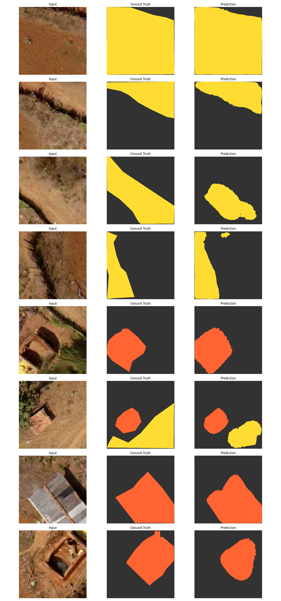

# svamitva-feature-extraction-ai

# AI-Based Feature Extraction from Drone Orthophotos

## Results




# AI-Based Feature Extraction from Drone Orthophotos

## Overview
This project develops a GeoAI pipeline to extract key features such as buildings, roads, and water bodies from SVAMITVA drone imagery using deep learning.

## Problem Statement
Manual extraction of geospatial features from drone orthophotos is time-consuming and inefficient. This project automates the process using AI.

## Methodology
- Converted ECW to GeoTIFF
- Tiled images into 512×512 patches (17,488 tiles)
- Trained DeepLabV3+ model for segmentation
- Applied post-processing for feature extraction
- Generated GIS-compatible GeoJSON output

## Results
- Buildings detected: 4,495
- Roads detected: 6,859
- Water bodies detected: 7,589
- Total features: 18,943

## Output
- Segmentation predictions (eval_results.png)
- Extracted features (GeoJSON format)
- GIS visualization using QGIS

## Technologies Used
- Python
- PyTorch
- OpenCV
- Rasterio
- QGIS

## How to Run
1. Install dependencies
2. Run:
```bash
python scripts/predict_and_visualize.py
python scripts/predict_geojson.py
